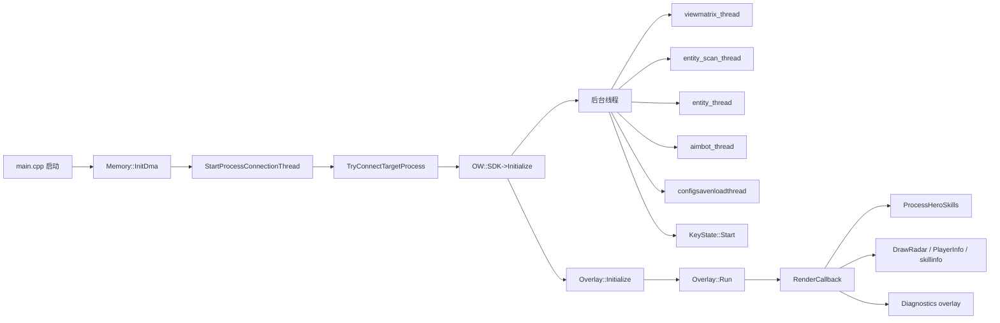
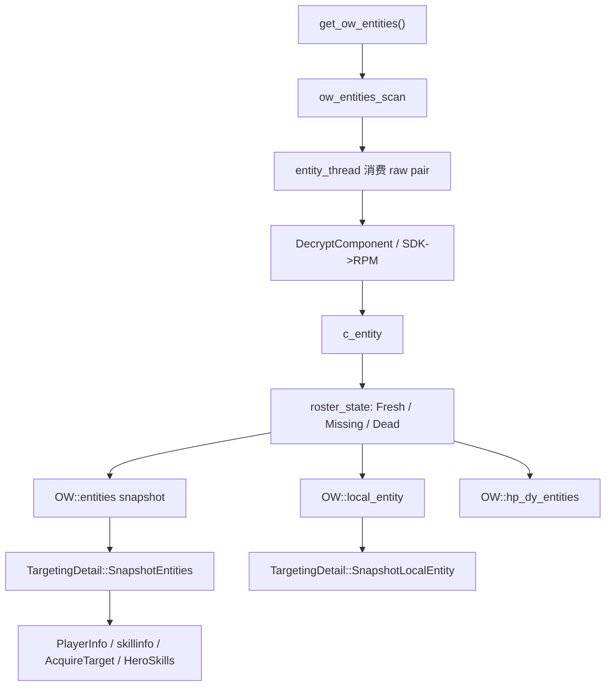
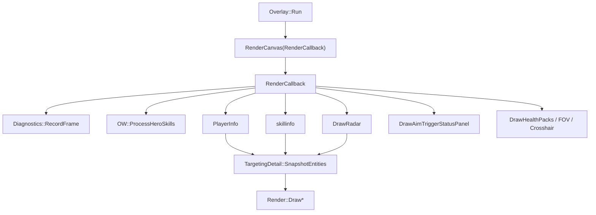
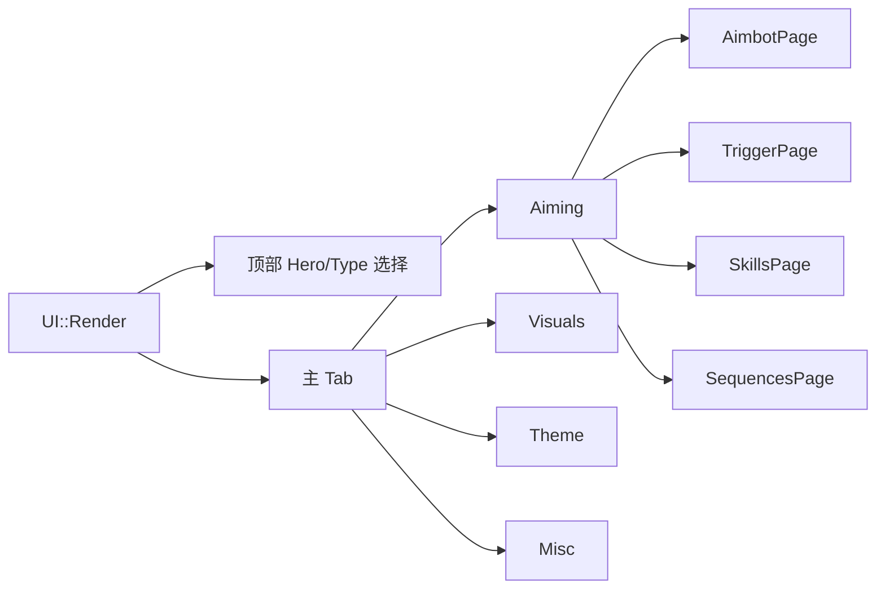

# Unleashed 开发文档

2026-06-02 note: `CnOffsetProbe` has moved out of this runtime tree. Edit,
build, and run the live offset validator from `D:\Desktop\downp\vertifytool`;
`Unleashed` keeps only runtime-required offset profile behavior.

版本：2026-06-07
覆盖范围：当前工作树 `D:\Desktop\ClaudeCodexCoding\Unleashed`  
面向读者：从未打开过 IDE、没有读过本项目代码，但准备参与需求、调试、验收和后续开发沟通的人。

## 先说结论

这个项目不是一个传统“点开 IDE 就能马上看懂”的小程序。它更像一个由多条后台线程、硬件数据读取层、实时数据处理层、透明 DX11 画布、独立 ImGui 菜单窗口、配置系统、输入设备适配层组成的实时外部 Overlay 应用。

你后续参与时，最重要的不是一开始就看懂每一行 C++，而是先建立这条主线：

```text
启动 main()
  -> 初始化 DMA / 诊断日志 / 配置
  -> 启动 ProcessConnection 后台连接/重连目标进程
  -> 连接成功后初始化 SDK 与 active offset profile
  -> 启动后台线程持续刷新数据快照；未连接时线程应等待
  -> 创建透明 DX11 Overlay 和 ImGui 菜单
  -> 每帧只消费快照并绘制，不在渲染路径里直接做 DMA 读取
```

代码里保留了 `Aimbot`、`Trigger`、`HeroSkill` 等历史命名。本文会按源码真实名字写，因为这样你才能用 `rg`、IDE 搜索和日志对上号。后续开发仍以工作区 `AGENTS.md` 为边界：这是一个独立外部应用，不注入、不 hook、不修改目标进程；默认只做外部读取、诊断展示、设备输入输出和 Overlay 呈现。

## 当前工程快照

当前 Git 基线：

```text
1852e74 Add aim preset configuration support
```

当前工作树已有未提交修改：

```text
告警：下面这些是当前工作树里的代码变更，本文档会按这些源码事实更新说明，但不会回退或改动它们。

include/Utils/Config.hpp
src/Features/UI.cpp
src/Kmbox/KmBoxNetManager.cpp
src/Tools/MockHardwareSelfTest.cpp
src/Utils/Config.cpp
src/main.cpp
```

这份文档内容基于当前工作树读取到的代码，而不只基于最后一次提交。也就是说，如果你打开 IDE 看到未提交 diff，不要惊讶：本文会把它们当成“当前真实工程状态”解释。

### 最近改动速览

从上次文档基线 `697f6c7` 到当前 HEAD，以及当前未提交 diff，最值得你先知道的变化是：

```text
进程连接：
  启动时不再阻塞等待目标进程；main.cpp 启动 ProcessConnection 后台线程，Overlay 可以先打开。
  目标进程缺失、退出或 PID 变化时，连接线程会清空运行时快照、DetachProcess，并自动/手动重连。

Runtime offset profile：
  Offsets.hpp 现在有 world/bz 和 cn/ne 两套 RuntimeOffsetProfile。
  main.cpp 会根据 Neac* 进程是否存在选择 CN/NE 或 world/BZ profile。
  CN/NE 当前使用 direct ViewMatrix root、identity component transform、0x98 visibility raw bool。

配置路径：
  ConfigPath() 不再是简单 ".\\config.ini"。
  当前配置目录是 EXE 相对的 config\\，并会迁移旧位置的 config.ini 与 .heroes.json。
  --config-check 会打印当前 directory/profile/path/heroPath，是排查配置源的第一命令。

FOV 语义：
  FOV 从旧的 aperture 口径迁移为“相机 forward 到目标方向的角度上限”。
  kMaxFovDeg = 180，kDefaultFovDeg = 100。
  旧配置版本的 200/360 aperture 会迁移成 100/180 angle。

Aim/Trigger slot：
  Aim slot 仍然拥有 FOV、hitbox、prediction、behavior、fire policy 等完整运行时参数。
  Trigger slot 不再独立编辑/驱动 FOV；Trigger 负责触发条件，Aim FOV ring 只画 Aim slot。

Aim behavior / method：
  Aim slot 保存高层 aimBehavior 和 speed scale。
  Misc > Method / Smoothing 持有每种 behavior 对应的 smoothing method、base speed、acceleration。
  AimBehaviorSmoothInput(...) 把 behavior profile + slot smooth/scale 转成 runtime smooth input。

Weapon spec / projectile：
  WeaponSpec.cpp 新增 71 条武器 spec，包含 aim class、prediction、fire policy、默认 behavior、来源说明。
  Target.hpp 会按 local hero + attack action 解析 spec，并优先使用 spec 的 projectileSpeed/gravity/radius。

Hitbox：
  hitbox 从旧世界半径迁移成百分比 scale。
  HeroGeometrySpec.cpp 提供 fallback bone radius，WeaponSpec 提供 projectile radius。
  ResolveEffectiveHitWindow(...) = bone radius + projectile radius，再乘 hitbox scale。

Motion estimate：
  Motion.hpp 新增 EntityMotionEstimate。
  如果 reported velocity 为 0 但 render sample 的世界坐标有合理位移，会用 world-delta fallback。
  MotionEstimatorSelfTest 覆盖这个 fallback。

Lead prediction：
  include/Game/LeadPrediction.hpp 新增瞄准 settle time、输入延迟和 pre-fire 位移估算。
  Target.hpp 现在通过 ResolveProjectileRuntimeSpec(...) 与 ResolveLeadPrediction(...) 统一处理 projectile speed/gravity、motion fallback 和提前量。
  LeadPredictionSelfTest 覆盖 prediction override、settle time、pre-fire delay clamp 和目标速度位移。

Tracking deadzone：
  Aim slot 的 trackingDeadzone 不再只是硬停止；离开 deadzone 后会经过 TrackingDeadzoneDampingScale(...) 平滑爬升。
  半径内会 ResetAimSmoothingState() 并停止输出，边界带宽由 TrackingDeadzoneDampingWidthPixels(...) 计算。
  TrackingDeadzoneDampingSelfTest 覆盖这个边界曲线。

HeroSkills：
  HeroSkillSettings 已扩展到 skillKey、tracking 参数、projectile 参数、百分比/绝对血量阈值、ComboAction 和 Auto Melee。
  Activation Key 表示触发这个技能逻辑的按键，Skill Key 表示技能真正输出的按键。
  Zarya propel-jump 默认 Activation Key=Mouse4，Skill Key=RightMouse。
  带 TrackingOverlay 的技能现在可以在 Skills UI 里配置 Skill Aim：Aim Behavior、Speed Scale、FOV、Bone、Hitbox Scale，以及 projectileSpeed/projectileRadius/projectileGravity/preFireDelayMs。
  Ana sleep-dart、Roadhog chain-hook、Tracer pulse-bomb、Soldier helix-rockets、Echo sticky-bombs、Brigitte whip-shot、Sigma accretion 等 projectile 技能都有默认值和自检覆盖。
  Auto Melee 现在是按英雄生成的通用 hero skill，使用 QuickMelee、kAimBoneClosest、绝对敌方血量阈值、距离和 hitbox gate。

Aim preset / slot：
  hero JSON 现在区分 heroAimPresets 和 heroTriggerPresets；Aim/Trigger 有独立 slot list、enabled/name/preset。
  UI 可以新增、删除、启用和应用 hero-specific Aim/Trigger slot；旧 INI 和旧 JSON 会迁移到当前结构。
  Aim method/behavior preset 现在可通过 aimBehaviorPresetId / aimMethodPresets / aimBehaviorPresets 驱动，AimPresetConfigSelfTest 覆盖选择与 fallback。

Mock hardware：
  新增 Kmbox/KmBoxMock.* 和 inputSource=4/mock 运行路径，用来离线验证输出移动、按钮状态、键盘输出、mouse mask、mock input 和故障模式。
  MockHardwareSelfTest 覆盖 Move/Button/ButtonStateMask/Keyboard/MaskMouse/Unmask、InputJitter、StuckButtons 和 KMBox monitor port 推荐值。

Hanzo / charged fire：
  Hanzo 新增 custom charged flick 状态，按 charge percent 或 fallback charge time 决定释放，并在状态变化、secondary aim、sequence block 等场景重置。
  tracking session identity 会在目标、按键、行为切换时重置运行时平滑状态，避免旧 session 状态串到新目标。

当前未提交源码状态：
  KMBox command port 与 monitor port 相同时会自动改成推荐 monitor port；NormalizeKmboxPorts() 会在 UI 连接和 main 初始化前运行。
  UDP command/monitor socket 会尝试禁用 SIO_UDP_CONNRESET；monitor 启动改为先开 listener，再发 cmd_monitor，失败会 EndMonitor 清理。
  MockHardwareSelfTest 已把 monitor port 推荐值纳入自检。

工具目标：
  CMake 除 Unleashed 外还有 MotionEstimatorSelfTest、FovConfigSelfTest、TrackingDeadzoneDampingSelfTest、AimPresetConfigSelfTest、LeadPredictionSelfTest、HeroSkillConfigSelfTest、MockHardwareSelfTest。
  CnOffsetProbe 已迁到 D:\Desktop\downp\vertifytool。
  这 7 个轻量自检都已接入 ctest。
```

## 你应该如何读这份文档

建议按三轮读：

第一轮，只看“整体架构”“启动流程”“核心文件地图”。目标是知道出了问题时该先搜哪里。

第二轮，看“实体数据管线”“渲染管线”“配置管线”“输入/KMBox 管线”。目标是能和我说清楚一个需求大概会穿过哪些文件。

第三轮，看“常见改动模板”“排查手册”“协作提问模板”。目标是以后你不用说“这个功能不对”，而是可以说“这个 UI 值写进配置了，但 runtime 似乎没有消费，我们从 UI -> Config -> Runtime 追一下”。

## 一张总图



一句话版：

`main.cpp` 负责拉起世界、配置 CLI、启动进程连接线程和 Overlay；`Memory` 和 `SDK` 负责外部读取；`ProcessConnection` 负责连接/断开/重连状态；`Overwatch.hpp` 里的线程负责把原始内存加工成快照；`Target.hpp` 负责从快照里挑选运行时目标、预测和命中窗口；`Renderer/Overlay` 负责窗口和 D3D11；`Features/UI.cpp` 负责菜单；`Config.cpp` 负责配置目录、保存、加载、迁移和校验；`HeroSkills.cpp` 负责英雄技能和序列型输入；`Kmbox` 负责设备输出和输入监听。

## 构建和运行

项目使用 C++20、MSVC、CMake、Visual Studio Community 2026 / Visual Studio 18 2026 generator。

唯一推荐构建入口：

```powershell
cd D:\Desktop\ClaudeCodexCoding\Unleashed
.\build-release.ps1
```

不要新建 `build-vs2026`、`out`、`cmake-build-*` 之类平行构建目录。当前项目约定的构建树只有：

```text
D:\Desktop\ClaudeCodexCoding\Unleashed\build
```

构建脚本做两件事：

```powershell
cmake --preset vs2026
cmake --build --preset release
```

对应配置在：

```text
CMakePresets.json
```

`CMakeLists.txt` 当前定义这些可执行目标：

```text
Unleashed                主 DX11/ImGui Overlay 程序
MotionEstimatorSelfTest  运动估计 fallback 自检
FovConfigSelfTest        FOV 配置语义/迁移自检
TrackingDeadzoneDampingSelfTest
                         Tracking deadzone 边界阻尼曲线自检
AimPresetConfigSelfTest  Aim method/behavior preset 解析与 fallback 自检
LeadPredictionSelfTest   lead prediction、settle/pre-fire timing 自检
HeroSkillConfigSelfTest  Hero skill 默认值、Skill Aim/projectile 配置自检
MockHardwareSelfTest     Mock hardware 输入/输出/mask/fault mode 自检
```

其中 7 个轻量自检已经接入 CTest：

```text
MotionEstimatorSelfTest
FovConfigSelfTest
TrackingDeadzoneDampingSelfTest
AimPresetConfigSelfTest
LeadPredictionSelfTest
HeroSkillConfigSelfTest
MockHardwareSelfTest
```

构建脚本会编译这些目标。需要只跑自检时，可以在构建完成后运行：

```powershell
ctest --test-dir .\build -C Release --output-on-failure
```

如果当前 shell 找不到 `ctest`，优先用 Visual Studio bundled CMake/CTest，或者直接走 `.\build-release.ps1` 先完成常规验证。

构建后会复制这些运行时资源到输出目录：

```text
vendor/leechcore/*.dll
config/dma_device.cfg
assets/icons
assets/heroes
assets/ability-icons
```

如果构建失败，正确做法是先看第一个真实编译错误，不要一次猜多个修复点。因为这个项目里很多模块互相包含，后续错误常常只是第一个错误的连锁反应。

## 根目录结构

```text
Unleashed/
  CMakeLists.txt              CMake 主目标、源文件列表、链接库、构建后复制资源
  CMakePresets.json           vs2026/release/debug preset
  build-release.ps1           推荐构建入口
  config.ini                  主 INI 配置
  config.heroes.json          英雄配置 JSON
  config/                     EXE 相对配置目录；运行时 config.ini 与 hero sidecar 最终会迁移到这里
  config/dma_device.cfg       DMA 设备类型配置
  include/                    头文件、核心 inline 实现、共享类型
  src/                        .cpp 实现、main、UI、Renderer、Memory、Kmbox、Tools
  src/Tools/                  轻量 self-test 工具；动态验证探针在 D:\Desktop\downp\vertifytool
  vendor/                     imgui、leechcore、rapidjson、stb
  assets/                     图标、英雄头像、技能图标
  data/                       研究/校验数据
  docs/                       本文档所在目录
```

当前源代码规模的重点文件：

```text
include/Game/Overwatch.hpp       约 6660 行
src/Utils/Config.cpp             约 6160 行
src/Features/UI.cpp              约 5747 行
src/Game/HeroSkills.cpp          约 3984 行
include/Game/Target.hpp          约 2698 行
src/Memory/Memory.cpp            约 1669 行
src/main.cpp                     约 1568 行
src/Kmbox/KmBoxNetManager.cpp    约 1407 行
src/Renderer/Overlay.cpp         约 984 行
include/Memory/KeyState.hpp      约 920 行
```

这意味着：你以后不要把 `Overwatch.hpp` 当成普通头文件理解，它实际上装了大量运行时实现。读这个项目时，先按功能块读，不要从第 1 行硬读到第 6660 行。

## C++ 文件怎么读

本项目有两种代码组织方式：

第一种是常规 C++：

```text
include/Renderer/Overlay.hpp  声明类和函数
src/Renderer/Overlay.cpp      实现类和函数
```

第二种是“头文件里写大量 inline 实现”：

```text
include/Game/Overwatch.hpp
include/Game/Target.hpp
include/Memory/KeyState.hpp
```

为什么会这样？实时路径里很多小函数被写成 `inline`，并且一些历史模块没有拆进 `.cpp`。所以你搜索函数时，不要只搜 `src/`，也要搜 `include/`。

推荐搜索命令：

```powershell
rg -n "函数名或变量名" include src
rg -n "SnapshotEntities|IsRuntimeTargetValid|ProcessHeroSkills" include src
rg --files include src
```

常见 C++ 关键字在本项目里的意思：

```text
namespace OW              项目主要运行时命名空间
namespace Diagnostics     诊断日志和状态快照
inline                    多数在头文件里定义的函数/变量
std::vector               动态数组，例如实体列表
std::mutex                互斥锁，例如 g_mutex 保护实体快照
std::atomic               多线程安全的标志或计数器
std::thread / std::jthread 后台线程
std::lock_guard           自动加锁/解锁
__try / __except          Windows SEH，保护外部读取链路避免异常直接崩
```

## 核心文件地图

### src/main.cpp

职责：应用入口、CLI 工具入口、配置加载、DMA 初始化、进程连接线程、后台线程启动、Overlay 主循环、每帧渲染回调、KMBox 初始化、关闭清理。

最重要的函数：

```text
main()
RunConfigCheckCli()
RunKmboxMoveTestCli()
RunKmboxCalibrationCli()
StartProcessConnectionThread()
TryConnectTargetProcess()
StartBackgroundThreads()
RenderCallback()
InitializeKmBoxFromConfig()
```

你想知道“程序启动后到底先干什么”“为什么 Overlay 能在目标进程未启动时先打开”“为什么 PID 变化后会自动重连”，就看这里。

### include/Game/Overwatch.hpp

职责：这个文件是当前项目最大的运行时集合，包含：

```text
全局运行状态
viewMatrix / viewMatrix_xor
entity_scan_thread()
entity_thread()
viewmatrix_thread()
PlayerInfo()
skillinfo()
AimbotDetail 命名空间
aimbot_thread()
configsavenloadthread()
looprpmthread()
ProcessConnection gate
```

你想知道“实体是怎么刷新”“渲染前数据在哪里”“运行时逻辑为什么触发/不触发”，大概率都要读这里。

近期要特别注意：`entity_scan_thread()`、`entity_thread()`、`viewmatrix_thread()`、`aimbot_thread()`、`configsavenloadthread()`、`ProcessHeroSkills()` 都会检查 `OW::ProcessConnection::IsConnected()`。目标进程不存在时，这些路径应该 sleep 或跳过，而不是继续拿旧 base/address 跑。

### include/Game/Target.hpp

职责：目标快照、目标选择、FOV 角度评分、命中窗口、预测、运动估计、角度计算、输入输出换算、平滑算法。

最重要的功能块：

```text
TargetingDetail::SnapshotEntities()
TargetingDetail::SnapshotLocalEntity()
TargetingDetail::IsRuntimeTargetValid()
TargetingDetail::SnapshotFovRuntimeContext()
TargetingDetail::FovScoreDeg()
TargetingDetail::ResolveProjectileRuntimeSpec()
TargetingDetail::ResolveLeadPrediction()
TargetingDetail::EstimateMotionState()
AcquireTarget()
GetVector3()
GetVector3aim2()
in_range()
SendMouseMove()
SendMouseButton()
SmoothDispatch()
```

你想知道“为什么选了这个目标”“为什么没有目标”“某个运行时判断的角度/距离公式是什么”“预测为什么使用某个弹速/重力/半径”，先看这里。

关联新文件：

```text
include/Game/AimArchitecture.hpp   aim class、prediction/fire policy、trace/unlock、smoothing controller 等枚举和结构
include/Game/WeaponSpec.hpp        weapon spec 查询接口
src/Game/WeaponSpec.cpp            71 条 hero/action 武器规格
include/Game/HeroGeometrySpec.hpp  bone radius / hit window 查询接口
src/Game/HeroGeometrySpec.cpp      fallback bone radius 与 ResolveEffectiveHitWindow()
include/Game/Motion.hpp            reported velocity 与 world-delta fallback 的运动估计
include/Game/LeadPrediction.hpp    settle time、input delay、pre-fire 位移与 lead timing
```

### include/Game/Entity.hpp

职责：`OW::c_entity` 数据结构和骨骼读取帮助函数。

重要字段：

```text
address / LinkBase / HealthBase / TeamBase / VelocityBase / HeroBase
HeroID
PlayerHealth / PlayerHealthMax
Alive / Vis / Team
roster_state / roster_key / match_id
head_pos / neck_pos / chest_pos / skeleton_bones
velocity / Rot / pos
skillcd1 / skillcd2 / ultimate
```

`c_entity` 是“处理后的实体快照”。后续渲染、目标选择、技能逻辑都尽量消费这个结构，而不是直接读原始内存。

### src/Memory/Memory.cpp 与 include/Memory/Memory.h

职责：LeechCore / VMMDLL 硬件读取封装。

关键函数：

```text
LoadDmaDeviceConfig()
InitDma()
AttachToProcess()
FixCr3()
Read()
Write()
CreateScatterHandle()
ExecuteReadScatter()
FindSignature()
```

虽然类里有 `Write` 能力，但当前工作边界默认是外部读取和诊断，不应随意引入远程写入行为。

### include/Game/SDK.hpp

职责：在 `Memory` 之上包一层 `OW::MemorySDK`，让游戏/数据层用统一 API 读数据。

关键接口：

```text
OW::SDK->Initialize()
OW::SDK->RPM<T>(address)
OW::SDK->read_range(address, buffer, size)
OW::SDK->BeginFrame()
OW::SDK->GetModuleBaseAddress()
```

### src/Renderer/Overlay.cpp

职责：创建两个 DX11/ImGui 上下文和两个窗口。

两个窗口：

```text
canvas window  透明全屏 Overlay 画布
menu window    独立置顶 ImGui 菜单窗口
```

核心函数：

```text
Overlay::Initialize()
Overlay::Run()
Overlay::RenderCanvas()
Overlay::RenderMenu()
Overlay::UpdateCanvasBounds()
Overlay::UpdateSwapChainSizes()
```

### src/Renderer/Renderer.cpp

职责：绘图原语。

常用接口：

```text
Render::DrawLine()
Render::DrawRect()
Render::DrawFilledRect()
Render::DrawCircle()
Render::DrawText()
Render::DrawHealthBar()
Render::DrawIcon()
```

### src/Renderer/IconManager.cpp

职责：加载 PNG/SVG 资源为 D3D11 shader resource view。

主要资源路径：

```text
assets/icons
assets/heroes/<hero>/avatar.png
assets/ability-icons/<hero>/<ability>.png
```

### src/Features/UI.cpp

职责：ImGui 菜单和所有用户可见设置。

页面入口：

```text
UI::AimbotPage()
UI::TriggerPage()
UI::SkillsPage()
UI::SequencesPage()
UI::VisualsPage()
UI::ThemePage()
UI::MiscPage()
UI::Render()
```

如果“界面上有没有某个控件”“某个控件是不是保存配置”，先看这里。

### include/Utils/Config.hpp 与 src/Utils/Config.cpp

职责：所有配置变量、默认值、配置目录、保存、加载、校验、迁移、hero sidecar JSON、profile 枚举。

关键点：

```text
OW::Config::ConfigDirectoryPath() -> EXE 相对 config\\，并迁移旧配置文件
OW::Config::ConfigPath()          -> ConfigDirectoryPath() + "\\" + configFileName
OW::Config::HeroConfigPath()      -> config.ini 对应 config.heroes.json
config_version                    -> 当前为 7
hero config version               -> 当前为 10
SaveConfig()
LoadConfig()
SaveHeroConfig()
LoadHeroConfig()
SaveConfigForHero()
LoadConfigForHero()
NormalizeHeroPresets()
```

当前配置迁移里最重要的是这几层：

```text
config_version < 5 或 hero JSON version < 2:
  老版本把 FOV 当 aperture 存，会用 LegacyFovApertureToAngleDeg() 把 200 迁移为 100、360 迁移为 180。

config_version < 6 或 hero JSON version < 3:
  老 aim behavior 语义会通过 NormalizeAimBehaviorForLoad(...) 迁移到当前 Tracking/Flick/Flick2nd/Reacquire 模型。

hero JSON version < 4 或缺少 projectile 字段:
  projectile aim 技能会恢复 Skill Aim/projectile 默认值；Ana sleep-dart、Roadhog chain-hook 会补 trackingAimBehavior、projectileSpeed、preFireDelayMs 等字段。

hero JSON version < 5:
  Roadhog chain-hook 的 enemyHealthThreshold 会从旧的 50% 迁移到当前默认 100%，避免 Mouse4 hook 被低血量过滤误拦。

hero JSON version < 7 / < 8:
  Ana 的 Sleep Dart / Biotic Grenade 映射和 Sleep Dart 全血目标默认值会修正到当前定义。

hero JSON version < 9:
  documented hero aim/trigger slot defaults 会补齐；heroAimPresets 与 heroTriggerPresets 成为当前 JSON 主结构。

hero JSON version < 10 或缺少 preset 字段:
  aim method/behavior preset、aimBehaviorPresetId、skill tracking aimBehaviorPresetId 等新字段会补齐或归一化。
```

### src/Game/HeroSkills.cpp 与 include/Game/HeroSkills.hpp

职责：英雄技能定义、运行时技能动作、输入序列、视角控制、Skill Aim、projectile trajectory、弹药保护、冷却保护、技能触发键和实际输出键的分离。

核心入口：

```text
OW::ProcessHeroSkills()
OW::RunInputSequence()
OW::RunViewpointController()
FindBestSkillAimCandidate()
MoveSkillAimAndCheckReady()
OW::CancelActiveSkill()
OW::ShouldBlockForActiveSequence()
```

`ProcessHeroSkills()` 在每帧 `RenderCallback()` 一开始被调用，所以它不是独立线程，而是跟渲染帧一起 tick。

近期要特别注意两组字段：

```text
Config::HeroSkillSettings::key       Activation Key，触发技能逻辑
Config::HeroSkillSettings::skillKey  Skill Key，真正按下/释放的输出键

Config::HeroSkillSettings::tracking  Skill Aim 的 behavior / speedScale / FOV / bone / hitbox
projectileSpeed / projectileRadius / projectileGravity / preFireDelayMs
                                     技能 projectile 预测和发射前延迟
```

旧配置没有 `skillKey` 时会默认继承 `key`，但 Zarya `propel-jump` 会迁移为右键输出。Ana `sleep-dart` 和 Roadhog `chain-hook` 如果缺少新的 Skill Aim/projectile 字段，会恢复当前默认值。

### include/Utils/ProcessConnection.hpp

职责：维护目标进程连接状态、手动重连请求、当前 PID/base 和可读状态文本。

关键接口：

```text
OW::ProcessConnection::RequestReconnect()
OW::ProcessConnection::ConsumeReconnectRequest()
OW::ProcessConnection::IsConnected()
OW::ProcessConnection::IsConnecting()
OW::ProcessConnection::ConnectedPid()
OW::ProcessConnection::ConnectedBaseAddress()
OW::ProcessConnection::SetStatus()
OW::ProcessConnection::StatusText()
```

这个文件不做实际 attach。实际 attach/clear/retry 在 `src/main.cpp` 的 `TryConnectTargetProcess()`、`MarkProcessDisconnected()`、`ClearProcessRuntimeSnapshots()`。

### src/Kmbox 和 include/Kmbox

职责：KMBox 网络/串口设备适配。

网络设备：

```text
KmBoxNetManager
KmBoxMouse
KmBoxKeyBoard
```

串口设备：

```text
KmBoxBManager
```

关键能力：

```text
Move / Move_Auto
Left / Right / Middle
ForceReleaseMouseButtons
StartMonitor
GetKeyState
IsMouseButtonPressed
InputPacketCount
```

## 启动流程详解

`main()` 是启动主线。当前可以拆成八步，其中“目标进程连接”已经从阻塞启动改成后台线程。

### 1. 控制台和配置初始状态

入口设置标题，打印 banner，然后设置：

```cpp
OW::Config::doingentity = 1;
```

`doingentity` 是多个后台循环是否继续工作的全局开关之一。关闭时会被置为 `0`。

### 2. 初始化 DMA

调用：

```cpp
mem.LoadDmaDeviceConfig();
mem.InitDma();
```

设备配置来自：

```text
config/dma_device.cfg
```

当前默认：

```ini
device=fpga
```

可选设备类型由 `Memory.cpp` 解析：

```text
fpga / ftd3xx
ftd3xxwu
rawtcp
hvsavedstate
```

DMA 初始化会尝试加载 `vmm.dll`、`leechcore.dll` 和对应设备 DLL。对于 FPGA 类设备，还会执行 FPGA 配置步骤。

### 3. 初始化诊断日志和配置

日志：

```cpp
Diagnostics::Initialize(..., "./unleashed_diag.log");
Diagnostics::InitializeAimLog("./unleashed_aim_diag.log");
```

配置：

```cpp
OW::Config::LoadConfig(OW::Config::ConfigPath());
OW::RefreshHostMouseDpi();
OW::RefreshScreenSizeFromConfig();
```

注意：日志路径是相对当前工作目录的。标准 release 运行时，日志通常会在可执行文件运行目录附近，比如 `build\Release`。

当前配置文件的真实路径建议从日志或命令确认，不要靠猜：

```powershell
.\build\Release\Unleashed.exe --config-check
```

这个命令会打印：

```text
[CONFIG] directory=...
[CONFIG] profile=...
[CONFIG] path=...
[CONFIG] heroPath=...
```

### 4. 初始化 KMBox

如果 `OW::Config::kmboxEnabled` 为真，`InitializeKmBoxFromConfig()` 会根据设备类型走网络或串口：

```text
kmboxDeviceType == 0  网络 KMBox
其他                 串口 KMBox B
```

网络 KMBox 会额外启动 monitor：

```cpp
kmbox::KmBoxMgr.KeyBoard.StartMonitor(kmboxMonitorPort)
```

这个 monitor 是后续热键输入来源之一。注意，输出命令连接成功不等于 monitor 输入成功，判断输入是否真的到达要看 `InputPacketCount()`。

### 5. 启动目标进程连接线程

现在启动不会卡在“等待目标进程”。`main()` 会调用：

```cpp
StartProcessConnectionThread()
```

连接线程每隔一段时间尝试：

```text
mem.GetPidFromName("Overwatch.exe")
TryConnectTargetProcess()
OW::SDK->Initialize()
```

成功连接后会设置：

```cpp
Diagnostics::SetProcessAttached(true);
OW::ProcessConnection::SetStatus(true, false, pid, base, "Connected ...")
```

SDK 会记录目标模块基址到：

```cpp
OW::SDK->dwGameBase
```

如果没有找到目标进程，Overlay 仍然可以继续初始化；后台线程会保持 `Waiting for Overwatch.exe`。如果目标进程退出或 PID 变化，`MarkProcessDisconnected()` 会清空实体、矩阵、诊断统计并 `mem.DetachProcess()`。

连接时还会选择 active offset profile：

```text
检测到 Neac* 进程 -> OW::offset::RuntimeProfile::CnNe
未检测到 Neac*  -> OW::offset::RuntimeProfile::WorldBz
```

### 6. 第一次连接成功后启动后台线程

`StartBackgroundThreads()` 启动：

```text
viewmatrix_thread
entity_scan_thread
entity_thread
aimbot_thread
configsavenloadthread
looprpmthread
KeyState::Start()
```

这些线程大多是 detach 的长期循环。它们没有统一 join，所以关闭时依赖全局开关、Sleep 和资源释放。

注意：后台线程不是 `main()` 一开始就无条件启动。当前逻辑是 `TryConnectTargetProcess()` 在 SDK 初始化成功后通过 `g_BackgroundThreadsStarted` 启动一次；KMBox calibration CLI 是例外，它会在 headless runtime 里显式启动。

### 7. 初始化 Overlay 并进入消息循环

```cpp
g_Overlay.Initialize(L"Unleashed DMA Overlay")
g_Overlay.Run(RenderCallback)
```

`Overlay::Run()` 是阻塞主循环。每帧：

```text
处理 Windows 消息
处理菜单显示/隐藏
更新画布位置和 swapchain 尺寸
RenderCanvas(RenderCallback)
如果菜单开启则 RenderMenu()
```

退出后会：

```text
CancelActiveSkill()
StopDiagnosticStatusThread()
Diagnostics::DumpStatus()
doingentity = 0
KeyState::Stop()
mem.CloseDma()
关闭 KMBox timer resolution
关闭日志
```

### 8. CLI 模式会提前返回

`main()` 开头会先检查这些命令行模式：

```text
--config-check
--kmbox-move-test
--kmbox-calibrate
--kmbox-reference-sens <float>
```

这些模式不会完整进入 Overlay 消息循环。比如 `--config-check` 只加载配置并打印路径；`--kmbox-calibrate` 会初始化 DMA/KMBox、启动 headless runtime，等待 player controller 后做采样并写回配置。

## 后台线程分工

### process connection thread

文件：

```text
src/main.cpp
include/Utils/ProcessConnection.hpp
```

职责：后台发现、连接、断开和重连目标进程。

核心状态：

```text
g_connected
g_connecting
g_reconnectRequested
g_pid
g_baseAddress
g_statusText
```

核心行为：

```text
目标进程不存在      -> SetStatus(false, false, 0, 0, "Waiting for Overwatch.exe")
手动请求重连        -> ConsumeReconnectRequest() 后强制 TryConnectTargetProcess(true, true)
PID 变化            -> DetachProcess()，清空快照，重新 SDK->Initialize()
连接成功            -> 设置 ProcessConnection connected/base/pid，并启动后台线程
断开或失败          -> 清空 entities/viewmatrix/diagnostic snapshot，避免旧数据继续被消费
```

其他线程看到未连接时应该安静等待：

```cpp
if (!OW::ProcessConnection::IsConnected()) {
    Sleep(100);
    continue;
}
```

所以如果日志里 `Process attached=false`，先不要追实体、FOV、热键或渲染逻辑，先追连接状态和 active offset profile。

### viewmatrix_thread

文件：

```text
include/Game/Overwatch.hpp
```

职责：每约 5ms 读取视图矩阵链路，更新：

```cpp
OW::viewMatrix
OW::viewMatrix_xor
OW::viewMatrixPtr
OW::viewMatrix_xor_ptr
```

写入时使用：

```cpp
OW::g_viewMatrixMutex
```

读取时用：

```cpp
OW::GetViewMatricesSnapshot(renderViewMatrix, renderViewMatrixXor)
```

重点：渲染和运行时逻辑尽量使用 snapshot，不直接拿半更新状态。

### entity_scan_thread

职责：低成本扫描原始实体 pair。

关键变量：

```cpp
OW::ow_entities_scan
OW::ow_entities
OW::abletotread
OW::entity_fast_scan_until_tick
```

它调用：

```cpp
OW::get_ow_entities()
```

然后把扫描结果暂存到 `ow_entities_scan`。这个线程只负责发现原始实体，不负责解密/加工完整实体字段。

### entity_thread

职责：把 `entity_scan_thread` 找到的原始 pair 加工成 `OW::c_entity` 快照。

核心步骤：

```text
读取 raw_entities
缓存 component base
读取 health / team / velocity / hero / bone / visibility / skill
构造 c_entity
识别 local_entity
维护 roster_state
发布 OW::entities / OW::hp_dy_entities / OW::local_entity
写入 Diagnostics 统计
```

这条线程是整个项目最重要的数据生产者。

发布共享数据时使用：

```cpp
std::lock_guard<std::mutex> lock(g_mutex);
OW::entities = ...
OW::hp_dy_entities = ...
OW::local_entity = ...
```

消费者应该使用：

```cpp
OW::TargetingDetail::SnapshotEntities()
OW::TargetingDetail::SnapshotDynamicEntities()
OW::TargetingDetail::SnapshotLocalEntity()
```

不要在渲染路径直接遍历 `OW::entities` 原始全局变量。

### aimbot_thread

职责：周期性 tick 运行时逻辑。

主循环：

```text
每 tick 调用 RunAimbotTickWithHeroPreset()
每约 5 秒写一条 aimbot.summary
Sleep(2)
```

它会根据配置调用：

```text
RunTriggerbot()
RunTracking()
RunFlick()
RunGenjiBlade()
RunAutoScaleFov()
RunAutoMelee()
RunAutoRmb()
RunAutoShiftGenji()
RunAutoSkill()
RunAutoShootCooldown()
RunReaperReloadCancel()
RunSecondAim()
```

这里的函数名是源码历史命名。排查时不要被名字吓到，按“输入条件 -> 快照目标 -> 角度/距离判断 -> 输出设备命令”这条链路追。

### configsavenloadthread

职责：根据当前 local hero 自动加载/保存配置。

主逻辑：

```text
如果菜单关闭，且 currentHeroId 变化：
  保存上一英雄配置
  加载当前英雄配置
  更新 nowhero 文案

如果 manualsave 为真：
  保存当前英雄配置
```

现在真实配置实现主要在 `src/Utils/Config.cpp`，这个线程里保留了大量 `#if 0` 的旧 INI 保存加载代码，读代码时可以跳过 `#if 0` 块。

### looprpmthread

当前基本是空循环：

```cpp
while (1) {
    Sleep(10);
}
```

注释写着 continuous recoil control / FOV change，但当前实现没有实际逻辑。以后看到这个线程不要误以为它在做大量工作。

### KeyState::Start

文件：

```text
include/Memory/KeyState.hpp
```

职责：通过 DMA 读取主机键鼠状态 bitmap，给输入热键判断提供 DMA 来源。

关键状态：

```cpp
KeyState::initialized
KeyState::gafAsyncKeyStateAddr
KeyState::keyStateReadPid
KeyState::detectedBuild
KeyState::resolvedSessionId
```

## 实体数据管线



### c_entity 是什么

`c_entity` 是一个“已加工实体”的快照。它不是原始内存对象，而是本项目自己组装出来的结构。

常用字段：

```text
address                  原始 component parent 地址
LinkBase                 link component base
HealthBase               health component base
TeamBase                 team component base
VelocityBase             velocity component base
HeroBase                 hero id component base
BoneBase                 bone component base
SkillBase                skill component base
VisBase                  visibility component base
AngleBase                angle/player controller component base

HeroID                   英雄 ID
PlayerHealth             当前生命
PlayerHealthMax          最大生命
Alive                    是否存活
Vis                      是否可见
Team                     当前逻辑中的队伍关系

head_pos / neck_pos / chest_pos
skeleton_bones
velocity
Rot
pos

roster_state             Fresh / Missing / Dead
roster_key               roster 稳定键
match_id                 用于 local/roster 识别
```

### roster_state 为什么重要

旧逻辑容易把“没扫到”“死了”“暂时缺字段”混成同一个状态。现在 `EntityRosterState` 把状态分成：

```text
Fresh    本轮有效，运行时选择器可以使用
Missing  暂时没扫到，渲染可保留衰减显示，运行时不能当目标
Dead     已死亡，运行时不能当目标
```

运行时目标判断：

```cpp
TargetingDetail::IsRuntimeTargetValid(entity, requireVisible)
```

大致条件：

```text
entity.roster_state == Fresh
entity.address != 0
entity.Alive == true
如果 requireVisible 为 true，还要求 entity.Vis == true
```

这就是以后排查“为什么它不选某个实体”的第一道门。

### render_sample 是什么

`c_entity` 里有：

```text
render_sample_tick_ms
previous_render_sample_tick_ms
has_previous_render_sample
previous_head_pos
previous_skeleton_bones
```

这些字段用于渲染插值。`entity_thread` 发布当前实体时会附带上一帧样本，`PlayerInfo()` 渲染时可以让框和骨骼移动更稳定。

## 渲染管线



`RenderCallback()` 是每帧画布渲染的核心。它做这些事：

```text
记录帧
处理英雄技能
绘制雷达
如果实体列表不空，绘制 PlayerInfo 和 skillinfo
绘制运行状态面板
绘制血包/FOV/准星
写入诊断状态
绘制 pipeline 诊断和日志 overlay
```

重点原则：

渲染路径应消费快照，不要把新的 DMA 读取塞进 `PlayerInfo()`、`skillinfo()`、`DrawRadar()` 这类函数里。渲染帧率和稳定性依赖这个边界。

## Overlay 双窗口模型

`Overlay.cpp` 创建两个窗口：

```text
Canvas 窗口：透明全屏，负责游戏/数据可视化画布
Menu 窗口：独立 borderless tool window，负责 ImGui 菜单
```

两个窗口各自有 ImGui context：

```cpp
m_canvasContext
m_menuContext
```

这也是为什么菜单不在 `RenderCallback()` 里画。`RenderCallback()` 只画 canvas，菜单由：

```cpp
Overlay::RenderMenu()
```

调用：

```cpp
UI::Render()
```

菜单开关来自：

```cpp
OW::Config::Menu
```

默认按键在配置中：

```ini
MenuToggleKey=36
```

36 是 `VK_HOME`。

## UI 管线



UI 状态在：

```cpp
include/Features/UI.hpp
```

核心状态：

```cpp
UI::state.activeTab
UI::state.aimingSubTab
UI::state.selectedTypeIndex
UI::state.aimHeroSegActive
UI::state.triggerHeroSegActive
```

页面函数：

```text
AimbotPage      主 Aim slot 配置：FOV、bone、hitbox、prediction、behavior、fire policy 等
TriggerPage     Trigger slot 配置：触发模式、触发按键、可见性/charge/间隔；不再独立编辑 FOV
SkillsPage      英雄技能配置
SequencesPage   输入序列配置
VisualsPage     可视化开关
ThemePage       颜色/展示位置/Aim FOV ring 样式
MiscPage        配置 profile、输入来源、KMBox、诊断、屏幕尺寸、Method/Smoothing
```

Theme 里当前子页名是：

```text
General
Aim FOV
```

`Aim FOV` 只配置 Aim slot ring。旧的 Trigger ring 已经移除，运行时也不再为 Trigger slot 单独设置 `FovRingSlotKind::Trigger`。

### UI 值如何影响运行时

正确链路一般是：

```text
UI 控件
  -> 写 OW::Config::<变量>
  -> SaveConfig 或 SaveHeroConfig
  -> runtime 每 tick 读取 OW::Config::<变量>
  -> Diagnostics 记录实际消费的值
```

如果一个界面值“看起来改了但运行不生效”，不要先猜渲染或设备问题。先追：

```text
UI 是否写到了正确 Config 变量？
Config 是否保存/加载？
runtime 是否读取的是同一个变量？
是否有 hero preset 临时覆盖？
是否被 ValidateUnlocked() clamp 回去了？
日志里实际值是多少？
```

## 配置系统

配置分两层：

```text
config.ini                    系统级/全局配置、输入、显示、KMBox、基础 aim 参数
<profile>.heroes.json          英雄 aim preset、trigger preset、skill preset
```

路径规则：

```cpp
ConfigDirectoryPath() -> ExecutableDirectoryPath() + "\\config"
ConfigPath()          -> ConfigDirectoryPath() + "\\" + configFileName
HeroConfigPath()      -> 去掉 .ini 后加 ".heroes.json"
```

例如：

```text
build\Release\config\config.ini -> build\Release\config\config.heroes.json
build\Release\config\rage_xy0headonly.ini -> build\Release\config\rage_xy0headonly.heroes.json
```

`ConfigDirectoryPath()` 会创建 `config\` 目录，并把旧位置的 `.ini` 与 `.heroes.json` 迁移进去。以后排查配置源，第一步应该看：

```text
unleashed_aim_diag.log 里的 main.config_loaded configPath=...
.\build\Release\Unleashed.exe --config-check
```

当前 `config.ini` 主要 section：

```text
[Meta]
[Aimbot]
[AimMethod]
[KMBox]
[Global]
```

当前 config version：

```text
7
```

当前 hero JSON version：

```text
10
```

版本迁移重点：

```text
config_version < 3：
  旧 preset bone index 会迁移到当前 aim bone 语义。

config_version < 5：
  旧 FOV aperture 会迁移到当前 angle limit。
  例如 200 -> 100，360 -> 180。

hero JSON version < 2：
  heroAimPresets / heroTriggerPresets / heroSkillPresets 中的 FOV 也按旧 aperture 迁移。
  迁移后会触发保存，把 version 写到当前值。

hero JSON version < 5 / < 7 / < 8：
  修正 Roadhog chain-hook、Ana Sleep Dart / Biotic Grenade 等已知旧默认值和按键映射。

hero JSON version < 9：
  补齐 documented hero aim/trigger slot defaults，heroAimPresets 与 heroTriggerPresets 成为当前主要结构。

hero JSON version < 10：
  补齐 aim method/behavior preset 与 aimBehaviorPresetId 相关字段。
```

`Config.cpp` 有一个重要锁：

```cpp
OW::Config::mutex
```

保存/加载对外函数通常会拿这个锁：

```cpp
SaveConfig()
LoadConfig()
SaveHeroConfig()
LoadHeroConfig()
SaveConfigForHero()
LoadConfigForHero()
```

### Profile 机制

`MiscPage()` 里可以切换 `.ini` profile。UI 会枚举 `ConfigDirectoryPath()` 下的 `*.ini`，不是随便枚举当前 PowerShell 工作目录。

切换 profile 时：

```text
更新 OW::Config::configFileName
LoadConfig()
RefreshScreenSizeFromConfig()
lastConfigProfile 写回配置
ApplySelectedTypePreset()
```

这意味着如果你排查“为什么换配置后值不对”，要同时看：

```text
config.ini 的 [Global] lastConfigProfile
当前 OW::Config::configFileName
对应的 .heroes.json 是否存在
当前 UI selectedTypeIndex / detected hero 是否触发了 preset 应用
--config-check 打印的 directory/path 是否和你编辑的文件一致
```

### Hero preset

英雄配置分 Aim 和 Trigger 两套 slot：

```cpp
OW::Config::heroAimPresets
OW::Config::heroTriggerPresets
```

每个英雄最多：

```cpp
kMaxHeroPresetSlots = 12
```

运行时选择逻辑在：

```text
AimbotDetail::TrySelectRuntimeAimPreset()
AimbotDetail::TrySelectRuntimeTriggerPreset()
```

大致规则：

```text
Aim：找当前英雄 enabled slot；如果有按键命中的 slot，优先选有 selectable entity 且距离范围通过的 slot；
     否则回退到有实体距离命中的 slot，再回退到第一个按键匹配 slot，最后才是 enabled fallback。
Trigger：找 enabled + trigger.enabled 的 slot；Hold/Toggle 看按键；Always 模式可直接成为候选；Toggle 有 sticky slot。
```

临时应用 preset 时使用 RAII：

```cpp
ScopedHeroPresetOverride
ScopedHeroTriggerPresetOverride
```

析构时恢复原全局配置。所以你在调试 runtime 时，看到某些 `OW::Config` 值短暂变化，不一定是 UI 写坏了，可能是 preset 临时覆盖正在生效。

当前 hero JSON 结构里，Aim 和 Trigger 已经是分离 store：

```text
heroAimPresets
heroTriggerPresets
heroSkillPresets
```

UI 里对应的操作会走：

```cpp
GetHeroAimPresetOrDefault()
GetHeroTriggerPresetOrDefault()
SetHeroAimPreset()
SetHeroTriggerPreset()
AddHeroAimSlot() / DeleteHeroAimSlot()
AddHeroTriggerSlot() / DeleteHeroTriggerSlot()
ApplyHeroAimPresetToGlobals()
ApplyHeroTriggerPresetToGlobals()
```

所以以后排查“某个英雄的 Aim slot 改了但 Trigger 没变”时，这是预期分离；不要把两个 store 合并回旧的单 preset 概念。

### Aim behavior 与 Method 分工

当前不要把 Aim slot 里的 `aimBehavior` 和 Misc 里的 method 混在一起：

```text
Aim slot:
  负责选行为类型，比如 Tracking / Flick / FlickClamp / FlickDelay / ReacquireAtApex。
  负责保存 slot 级 smooth/speed scale。

Misc > Method / Smoothing:
  负责每种 behavior 对应哪个 smoothing controller。
  负责 base speed、acceleration、PID、Bezier、Piecewise、AccelLimited、Constant 等细节。
  可以通过 aim method preset / aim behavior preset 复用配置。
```

运行时换算入口：

```cpp
OW::Config::AimBehaviorMethod(behavior)
OW::Config::AimBehaviorBaseSpeed(behavior)
OW::Config::AimBehaviorAcceleration(behavior)
OW::Config::AimBehaviorSmoothInput(behavior, smooth)
OW::Config::RuntimeAimConstantAngularSpeedDeg()
```

新的 preset 相关字段/容器：

```text
aimMethodPresets
aimBehaviorPresets
aimBehaviorPresetId
aimBehaviorMethodPreset[]
HeroPreset::aimBehaviorPresetId
HeroSkillTrackingParams::aimBehaviorPresetId
```

`AimPresetConfigSelfTest` 会验证 behavior preset 指向 method preset 后，method、base speed、move split 和 constant angular speed 都能被运行时读取；当 preset id 清空时也能回退到行为默认值。

Secondary aim 还有独立 override：

```text
secondaryTrackingMethod
secondaryFlickMethod
```

值为 `-1` 表示继承对应 behavior profile；非 `-1` 表示 secondary Tracking/Flick 单独指定 method。

### Tracking deadzone damping

Tracking deadzone 当前有两层语义：

```text
distancePx <= trackingDeadzone:
  停止输出，并 ResetAimSmoothingState()

trackingDeadzone < distancePx < trackingDeadzone + dampingWidth:
  按 smoothstep 曲线从 0 慢慢升到 1

超过边界带：
  使用完整 smooth input
```

关键入口：

```cpp
Config::ClampTrackingDeadzonePixels()
Config::TrackingDeadzoneDampingWidthPixels()
Config::TrackingDeadzoneDampingScale()
AimbotDetail::TrackingDeadzoneDampingScale()
```

`TrackingDeadzoneDampingWidthPixels(radius)` 会取 `radius * 0.5`，并 clamp 到 `8..48px`。例如 radius=20px 时，20px 内完全停，25px 处 scale 约 0.5，30px 以后恢复 1.0。

排查 tracking 速度“刚出 deadzone 就突然跳”的第一顺位日志是：

```text
tracking.deadzone_damping distancePx=... radiusPx=... scale=... smoothInput=...
```

对应自检：

```text
src/Tools/TrackingDeadzoneDampingSelfTest.cpp
```

### FOV 和 hitbox 配置语义

当前 FOV 是角度上限，不是完整锥体 aperture：

```text
score = 相机 forward 与目标方向的夹角
within = score <= fovDeg
```

所以：

```text
100 deg 不是旧意义的 200 deg aperture，而是当前直接比较的角度上限。
180 deg 是最大值，代表完整前后半球的上限。
```

hitbox 当前是百分比 scale：

```text
effectiveHitWindow = (boneRadius + projectileRadius) * hitboxScalePercent / 100
```

相关代码：

```text
Config::ClampFovDeg()
Config::LegacyFovApertureToAngleDeg()
Config::ClampHitboxScalePercent()
Config::HitboxScaleMultiplier()
ResolveEffectiveHitWindow()
```

## 目标选择和运行时判断

核心入口：

```cpp
OW::AcquireTarget()
OW::GetVector3()
OW::GetVector3aim2()
```

`AcquireTarget()` 的基本筛选顺序：

```text
拿实体快照
拿 local_entity 快照
解析当前武器 spec
解析 target lock policy
判断 prediction 是否启用
遍历 entities
  -> IsRuntimeTargetValid
  -> TargetTeamMatches
  -> visibility / trace 策略
  -> target lock min time / hysteresis
  -> distance filter
  -> 选骨骼点
  -> prediction
  -> WorldToScreen
  -> FOV filter
  -> priority score
保存 best candidate
CommitTargetLockRuntime
返回 TargetCandidate
```

当前 `TargetCandidate` 不只是坐标，它还带：

```text
entitySnapshot
boneId
rawAimPoint
predictedAimPoint
screenPoint
distance
fovScore
effectiveHitWindow
motion
lockPolicy
weaponSpec
```

这意味着排查“为什么选它”时，不要只看 `Targetenemyi`；要看 candidate 的 FOV score、hit window、weapon spec、motion 和 lock policy。

`GetVector3()` 只是把 `AcquireTarget()` 的结果简化成一个世界坐标：

```cpp
return candidate.valid ? candidate.aimPoint : Vector3{};
```

所以如果你问“为什么没有目标”，真正要看的是 `AcquireTarget()` 里哪道条件没过，而不是只看 `GetVector3()`。

### in_range 公式

源码：

```cpp
float dist = MyPosition.DistTo(EnemyPosition);
radius /= dist;
return MyAngle.DistTo(EnemyAngle) <= radius;
```

含义：

```text
世界距离越远，同样世界半径换算成角度窗口越小。
判断的是本地视角角度与目标角度之间的距离是否落入 distance-scaled radius。
```

这类公式以后沟通时要尽量给出源码条件链，不要只说“对上了”或“没对上”。

### FOV 评分语义

当前 FOV 判断不再用屏幕圆半径当核心逻辑，而是用相机 forward 与目标方向的角度：

```cpp
TargetingDetail::SnapshotFovRuntimeContext()
TargetingDetail::FovScoreDeg()
TargetingDetail::IsWithinFovDeg()
```

简化公式：

```text
targetDir = normalize(targetPosition - camera)
scoreDeg  = acos(dot(cameraForward, targetDir))
pass      = scoreDeg <= Config::Fov
```

所以 `Config::Fov` 的单位就是度，范围 `0..180`。Overlay 上的 FOV ring 只是这个角度上限的可视化，半径计算在 `src/main.cpp` 的 `FovRadiusForViewport()`。

旧文档或旧配置里出现的 `200 deg`，现在要理解成迁移前 aperture；当前运行时默认是 `100 deg`。

### WeaponSpec 与预测

当前预测不再只靠全局 `predit_level` / `Gravitypredit` 猜。运行时会先解析：

```cpp
const WeaponSpec* weaponSpec = ResolveWeaponSpec(local_entity.HeroID, Config::aimbotAttack);
```

`WeaponSpec` 提供：

```text
heroId / heroName
weaponId / weaponName
action / order
aimClass
prediction.projectileSpeed
prediction.projectileRadius
prediction.gravity
prediction.chargeMinSpeed / chargeMaxSpeed
firePolicy
defaultBehavior
sourceUrl / sourceNote / confidence
```

预测解析入口：

```cpp
TargetingDetail::ResolveProjectileRuntimeSpec()
TargetingDetail::ResolveLeadPrediction()
EstimateAimSettleTimeMs()
BuildLeadTiming()
ApplyTargetMotionPreFireDelay()
```

优先级大致是：

```text
Hanzo auto speed 特例可覆盖 fallback speed
WeaponSpec 有 projectileSpeed -> 使用 spec speed/gravity
没有 spec 或 spec 不完整 -> 回退到 predit_level / Gravitypredit / projectile_arc
```

`ResolveLeadPrediction(...)` 不只算 projectile travel time。当前它还会合并：

```text
motion fallback 后的目标速度
当前瞄准 controller 的 settle time 估算
kmboxInputDelayMs
技能或武器路径传入的 extra pre-fire delay
```

这些字段会写进 `lead.solve` 诊断日志。排查“预判过头/不足”时，先看 `projectile(source=...)`、`motion(source=...)`、`timing(settleMs/inputMs/extraPreFireMs/preFireMs)`，不要只盯 `predit_level`。

对应自检：

```text
src/Tools/LeadPredictionSelfTest.cpp
```

### Motion fallback

近期新增 `include/Game/Motion.hpp`。它解决一个常见问题：实体 reported velocity 可能是 0，但连续 render sample 的世界坐标在移动。

`Motion::EstimateEntityMotion()` 会比较：

```text
reportedVelocity
worldDeltaVelocity = (pos - previous_pos) / sampleSeconds
```

如果 reported speed 很小但 world delta 合理，就使用 `WorldDeltaFallback`。这会影响：

```text
prediction velocity
EntityMotionState
target.primary 日志里的 motion 相关判断
```

对应自检：

```text
src/Tools/MotionEstimatorSelfTest.cpp
```

### Hit window

命中窗口现在由骨骼半径、弹体半径和 UI scale 共同决定：

```cpp
ResolveEffectiveHitWindow(heroId, boneId, weaponSpec, hitboxScalePercent, fallbackBoneRadius)
```

当前 fallback bone radius 在：

```text
src/Game/HeroGeometrySpec.cpp
```

projectile radius 在：

```text
src/Game/WeaponSpec.cpp
```

UI 里的 `Hitbox` 是百分比。100 表示使用 resolved window 原值；150 是当前最大 scale；0 会把窗口压到 0。

### BuildAimData

位置：

```text
include/Game/Overwatch.hpp / AimbotDetail
```

职责：

```text
读本地 view direction
拿 viewMatrix snapshot
计算 local_angle
根据目标世界坐标计算 target_angle
按 smooth/acceleration 等配置得到 smoothed_angle
返回 local_angle / target_angle / smoothed_angle / local_pos
```

如果角度看起来不对，要先看：

```text
SDK->g_player_controller 是否有效
PlayerController + 0x1260 是否读到有效方向
viewMatrix_xor 的 camera location 是否有效
target world 坐标是否是 0
angle 日志里的 source 是 memory_viewdir 还是 matrix_forward
```

## 输入和 KMBox 管线

输入来源配置：

```cpp
OW::Config::inputSource
```

含义：

```text
0 = Auto，优先 KMBox monitor，之后 DMA，再之后 Local
1 = KMBox，若 monitor 不可用，回退 DMA + Local
2 = Local，只读 GetAsyncKeyState
3 = DMA，只读 KeyState bitmap，严格 DMA
4 = Mock，只读 kmbox::MockHardwareMgr 的模拟输入
```

运行时判断入口：

```cpp
AimbotDetail::IsInputVkDown()
AimbotDetail::IsInputVkDownQuiet()
```

KMBox monitor 是否可用：

```cpp
Config::kmboxEnabled
Config::kmboxDeviceType == 0
KmBoxMgr.KeyBoard.ListenerRuned == true
KmBoxMgr.KeyBoard.InputPacketCount() > 0
```

注意：`ListenerRuned=true` 只能说明监听线程启动，不代表输入包真的到了。`InputPacketCount() > 0` 才说明 monitor 收到过输入包。

Mock hardware 是否可用：

```cpp
Config::kmboxDeviceType == 2
kmbox::MockHardwareMgr.IsInitialized()
```

Mock 路径用于离线验证输入/输出链路，不依赖真实网络设备：

```text
inputSource=4                         只读 mock input
SendMouseMove / SendMouseButton       记录 mock output event
SendMouseButtonStateMask              记录完整按钮状态
MaskPhysicalMouseButtons / Unmask     记录 mock mouse mask
RecordKeyboardKey                     记录 keyboard output
MockFaultMode                         OutputTimeout / DropOutput / InputJitter / StuckButtons
```

当前 UI 的 key probe 会同时显示 `KMBox Monitor`、`DMA KeyState`、`Mock` 和 `Local`；Mock 页还能手动切换 L/R/M/X1/X2 输入、设置 fault mode、查看 event/button/key 计数。

网络 KMBox 有一个容易踩的端口边界：command port 和 monitor port 必须分开。当前未提交源码里新增了：

```cpp
Config::RecommendedKmboxMonitorPort(commandPort)
Config::NormalizeKmboxPorts()
```

如果 `kmboxMonitorPort == kmboxPort`，运行时会把 monitor port 改成推荐值：常规是 `commandPort + 1`，`65535` 时用 `65534`，非法 command port 回退到 `8809`。日志关键字：

```text
config.kmbox_monitor_port_adjusted
```

### 输出移动链路

角度 delta 到设备输出：

```text
MoveAimDelta()
  -> SendMouseMove(Vector3 delta)
  -> radians -> pixels
  -> calibratedPixelsPerRadian 或 kmboxAimSensitivity
  -> pitch/yaw scale
  -> integer accumulator
  -> optional micro split
  -> EnqueueKmboxPixelMove()
  -> network Move/Move_Auto 或 serial km_move/km_move_auto
```

相关配置：

```text
kmboxEnabled
kmboxDeviceType
kmboxAimSensitivity
calibratedPixelsPerRadian
calibratedPixelsPerRadianPitch
autoSyncSensitivity
gameMouseSensitivity
sensReference
aimbotPitchScale
moveSplitEnabled
moveSplitMaxPixels
moveSplitDelayUs
kmboxInputDelayMs
```

如果“有日志但不动”，重点查：

```text
kmboxEnabled 是否 true
delta_rad 是否非 0
scaled pixels 是否被截断为 0
EnqueueKmboxPixelMove status
KMBox 网络/串口连接状态
MockHardwareSnapshot 里的 moveEvents/buttonEvents/keyboardEvents
```

## HeroSkills 和序列系统

入口：

```cpp
OW::ProcessHeroSkills()
```

它每帧在 `RenderCallback()` 开头被调用，不是独立线程。

大致逻辑：

```text
如果 shutting down，CancelActiveSkill
读取 local_entity snapshot
处理 self-test reload
确定 heroId
如果 heroId 变化，CancelActiveSkill
遍历 AllHeroSkillDefinitions()
  -> 当前英雄匹配
  -> 读取 Config::HeroSkillSettings
  -> 如果 disabled，CancelSkill
  -> 冷却/弹药/手动 cooldown 检查
  -> sequence skill 走 RunInputSequence
  -> pitch/phase skill 走 RunViewpointController
  -> TrackingOverlay trajectory skill 走 FindBestSkillAimCandidate / MoveSkillAimAndCheckReady
  -> auto-melee skill 走 FindBestAutoMeleeCandidate / EvaluateAutoMeleeAction
  -> combo skill 走 Evaluate...Combo / ComboAction 分支
  -> runtime action 走 Evaluate...Action
```

### 输入序列

配置结构：

```cpp
Config::HeroSkillSequenceStep
Config::HeroSkillSettings
```

主要字段：

```text
buttonMask
durationMs
speedScale
jitterMs
```

运行入口：

```cpp
RunInputSequence(skillId, steps, key, trackingParams, ammoGuardEnabled, ammoGuardReserve)
```

它支持两种模式：

```text
worker 模式：std::jthread RunSequenceWorker
非 worker 模式：每帧推进 step
```

是否使用 worker：

```text
环境变量 UNLEASHED_SEQUENCE_WORKER
默认启用，设置为 0 可关闭
```

序列会设置：

```cpp
g_anyInputSequenceActive = true
```

其他运行时逻辑会通过：

```cpp
ShouldBlockForActiveSequence()
```

判断是否让路。

### Activation Key 与 Skill Key

当前英雄技能配置里有两个容易混淆的键：

```text
settings.key       Activation Key，触发这个技能逻辑
settings.skillKey  Skill Key，技能逻辑真正输出的键
```

UI 上对应：

```text
Activation Key
Skill Key
```

为什么要拆开？因为有些技能不是“按哪个键触发就输出哪个键”。例如：

```text
Zarya propel-jump:
  Activation Key = Mouse4
  Skill Key      = Right Mouse
```

旧 hero config 没有 `skillKey` 字段时：

```text
默认 skillKey = key
Zarya propel-jump 特例迁移为 Right Mouse
```

运行时输出入口会走：

```cpp
SkillOutputVk(settings)
MapHotkeyToVK(settings.skillKey >= 0 ? settings.skillKey : settings.key)
SetHotkeyState(...)
```

所以以后排查“技能触发了但按错键”，先看 `skillKey`，不要只看 `key`。

### 血量阈值语义

当前 Skill UI 同时有百分比阈值和绝对血量阈值：

```text
HealthThreshold / EnemyHealthThreshold / AllyHealthThreshold
  百分比语义，运行时通常来自 VitalityPercent(entity)。

HealthAbsolute / EnemyHealthAbsolute
  绝对 HP 语义，UI 会显示 Max Health，运行时用真实 PlayerHealth / max health 条件。
```

这点很重要：Roadhog chain-hook、Ana sleep-dart 这类“健康目标也要触发”的 skill 默认值已经迁移到 `enemyHealthThreshold=100%`；Auto Melee 则使用 `EnemyHealthAbsolute`，默认 `40 HP`。

### Skill Aim 与 projectile 技能

带 `HeroSkillControls::TrackingOverlay` 的技能会出现 Skills 页里的 `Skill Aim` 控制组：

```text
Aim Behavior
Speed Scale
FOV (deg)
Bone
Hitbox Scale
Projectile Speed
Projectile Radius
Projectile Gravity
Pre-fire Delay
```

这些字段存在：

```cpp
Config::HeroSkillTrackingParams
Config::HeroSkillSettings::tracking
Config::HeroSkillSettings::projectileSpeed
Config::HeroSkillSettings::projectileRadius
Config::HeroSkillSettings::projectileGravity
Config::HeroSkillSettings::preFireDelayMs
Config::HeroSkillTrackingParams::aimBehaviorPresetId
```

当前运行时链路：

```text
EvaluateTrajectoryAction()
  -> ResolveSkillProjectileRuntime()
  -> ScopedTrackingConfig(settings.tracking)
  -> FindBestSkillAimCandidate()
       -> SnapshotEntities / SnapshotLocalEntity
       -> FOV / distance / hp / visibility / minTargets
       -> ResolveLeadPrediction(...) 可选预测
       -> ResolveSkillHitWindow(...)
  -> MoveSkillAimAndCheckReady()
       -> BuildAimData()
       -> MoveAimDelta()
       -> in_range(before/after)
  -> StartTimedHotkey(skillKey)
```

也就是说，某个 projectile 技能“按了但不出手”时，不一定是热键问题。它可能卡在目标筛选、FOV、预测后距离、hit window ready、debounce 或 Skill Key 输出任一层。

当前默认值由 `HeroSkillConfigSelfTest` 固化的典型 aimed trajectory 技能包括：

```text
Ana sleep-dart:
  Activation Key = Mouse4
  Skill Key      = LeftShift
  Aim Behavior   = Flick
  Bone           = Chest
  projectileSpeed= 60.0
  projectileRadius=0.2
  preFireDelayMs = 320.0

Roadhog chain-hook:
  Activation Key = Mouse4
  Skill Key      = LeftShift
  Aim Behavior   = Flick
  Bone           = Chest
  projectileSpeed= 62.0
  projectileRadius=0.5
  preFireDelayMs = 100.0

Tracer pulse-bomb:
  Skill Key      = Q
  projectileSpeed= 15.0
  projectileGravity=true
  radius         = 3.0

Soldier helix-rockets / Echo sticky-bombs / Brigitte whip-shot / Sigma accretion:
  也通过同一套 projectile Skill Aim 默认值和自检保护。
```

关键诊断：

```text
skill.aim_tick ...
Hero skill aimed trajectory fired ...
lead.solve ...
```

旧 hero JSON 如果缺少 `trackingAimBehavior`、`projectileSpeed` 或 `preFireDelayMs`，加载时会用当前默认值恢复这些字段。这个迁移逻辑在 `src/Utils/Config.cpp` 的 `ShouldRestoreProjectileAimDefaults(...)` 和 `LoadHeroSkillPresetStoreJson(...)`。

### Auto Melee

Auto Melee 不是全局硬编码分支，而是通过 `AllHeroSkillDefinitions()` 给一组英雄动态追加同名 `auto-melee` skill：

```cpp
HeroSkillInputAction::QuickMelee
HeroSkillControls::EnemyHealthAbsolute
HeroSkillControls::Distance
HeroSkillControls::Bone
HeroSkillControls::Hitbox
MakeAutoMeleeDefaults()
AutoMeleeHeroDefinitionCount()
```

默认行为：

```text
Activation/Skill Key = V
Max Health           = 40 HP
Max Distance         = 3.0 m
Cooldown             = 0.55 s
Bone                 = kAimBoneClosest
Hitbox Scale         = kMaxHitboxScalePercent
```

运行时重点入口：

```cpp
FindBestAutoMeleeCandidate()
ResolveAutoMeleeBone()
IsAutoMeleeHitReady()
EvaluateAutoMeleeAction()
```

排查 Auto Melee 时，不要去全局 `AutoMelee` 旧开关里硬找所有逻辑；当前可见配置面在 hero skill 定义、UI controls 和 hero JSON skill store 里。

### 执行优先级

定义在：

```text
include/Game/InputOrchestrator.hpp
```

优先级：

```text
SequenceInternal  100
HeroSkill          60
Trigger            40
GlobalAim          20
```

所以输入序列激活时，全局运行时逻辑通常要让路，避免不同模块同时输出互相打架。

## 诊断系统

诊断命名空间：

```cpp
namespace Diagnostics
```

日志文件：

```text
unleashed_diag.log       常规运行/管线日志
unleashed_aim_diag.log   运行时 aim/input/sequence 详细日志
```

核心数据结构：

```cpp
Diagnostics::StatusSnapshot
```

包含：

```text
entityCount
lastScanEntityCount
entityScanHz / entityProcessHz
dmaReads
errors
dmaReady
processAttached
viewMatrixResolved / viewMatrixValid
render pipeline flags
entityProcess stats
playerInfo stats
localEntity stats
roster stats
```

重要 API：

```cpp
Diagnostics::Initialize()
Diagnostics::InitializeAimLog()
Diagnostics::Info/Warn/Error/Debug/Trace
Diagnostics::Aim()
Diagnostics::Snapshot()
Diagnostics::DumpStatus()
Diagnostics::SetEntityProcessStats()
Diagnostics::SetLocalEntityStats()
Diagnostics::SetRosterStats()
Diagnostics::RecordFrameTiming()
Diagnostics::RecordDmaRead()
```

### DMA callsite tagging

有一个 RAII 标记：

```cpp
Diagnostics::ScopedDmaCallsite
```

用于标记 DMA read 来自哪个路径：

```text
EntityScan
EntityDecrypt
ViewMatrix
BoneChain
KeyState
Aimbot
RenderCanvas
```

这对排查“哪里在高频读 DMA”特别有用。渲染路径如果出现大量 DMA read，通常是危险信号。

### 开启 pipeline overlay

很多 pipeline 详细日志受：

```cpp
OW::Config::kmboxDebugLog
```

控制。名字虽然叫 `kmboxDebugLog`，但它现在也控制一些 pipeline 诊断显示和日志。

## 工具和自检目标

当前项目不只有主程序。工具/自检的定位如下：

```text
Unleashed
  主 Overlay 程序；也承载 --config-check、--kmbox-move-test、--kmbox-calibrate CLI。

MotionEstimatorSelfTest
  纯本地自检，不需要 DMA/Overlay。验证 reported velocity 与 world-delta fallback。

FovConfigSelfTest
  纯本地自检，不需要 DMA/Overlay。验证 kMaxFovDeg=180、kDefaultFovDeg=100、旧 aperture 迁移。

TrackingDeadzoneDampingSelfTest
  纯本地自检，不需要 DMA/Overlay。验证 deadzone 内停止、边界 smoothstep 阻尼和 clamp 行为。

AimPresetConfigSelfTest
  纯本地自检，不需要 DMA/Overlay。验证 aim method preset / behavior preset、preset id fallback、constant angular speed。

LeadPredictionSelfTest
  纯本地自检，不需要 DMA/Overlay。验证 prediction override、aim settle time、input delay 和 pre-fire 位移。

HeroSkillConfigSelfTest
  纯本地自检，不需要 DMA/Overlay。验证 hero skill 默认配置、Skill Aim、projectile 参数、Auto Melee 和 control flags。

MockHardwareSelfTest
  纯本地自检，不需要 DMA/Overlay/真实 KMBox。验证 mock 输入输出、按钮状态、keyboard、mouse mask、fault mode 和 monitor port 推荐值。
```

常用命令：

```powershell
cd D:\Desktop\ClaudeCodexCoding\Unleashed
.\build-release.ps1
.\build\Release\Unleashed.exe --config-check
.\build\Release\Unleashed.exe --kmbox-move-test
.\build\Release\Unleashed.exe --kmbox-calibrate --kmbox-reference-sens 15
ctest --test-dir .\build -C Release --output-on-failure
```

什么时候用哪个：

```text
配置路径/当前 profile 不确定：
  先用 --config-check。

KMBox 有连接但移动不确定：
  用 --kmbox-move-test 看设备输出链路。

KMBox counts-per-radian 需要重标定：
  用 --kmbox-calibrate，必要时加 --kmbox-reference-sens。

CN/NE 或 world/BZ offset 语义变化：
  到 D:\Desktop\downp\vertifytool 用 CnOffsetProbe 做现场读数，再把 VERIFIED/CANDIDATE/UNRESOLVED 写清楚。

只改 Motion.hpp、FOV、tracking deadzone、lead prediction、aim preset 或 hero skill 默认配置：
  跑 ctest，至少让对应的 MotionEstimatorSelfTest / FovConfigSelfTest /
  TrackingDeadzoneDampingSelfTest / AimPresetConfigSelfTest / LeadPredictionSelfTest /
  HeroSkillConfigSelfTest 过。

只改 Mock hardware 或 input source/mock UI：
  跑 MockHardwareSelfTest；如果也碰了 KMBox 网络端口/monitor，仍然跑 build-release.ps1 和完整 ctest。
```

## 资源系统

资源目录：

```text
assets/icons
assets/heroes/<hero>/
assets/ability-icons/<hero>/
```

构建后会复制到输出目录。加载逻辑在：

```text
src/Renderer/IconManager.cpp
```

Hero avatar 预加载在：

```text
src/main.cpp / PreloadHeroAvatars()
```

技能图标预加载在：

```text
src/main.cpp / PreloadAbilityIcons()
```

如果图标不显示，按顺序查：

```text
源资源是否存在
CMake post-build 是否复制
输出目录 assets 是否完整
IconManager key 是否和 heroSlug / ability slug 一致
UI/渲染处是否请求了正确 key
```

## 常见改动模板

### 新增一个 UI 开关

标准链路：

```text
1. include/Utils/Config.hpp 增加变量和默认值
2. src/Utils/Config.cpp 增加 Save/Load/Validate
3. src/Features/UI.cpp 增加控件
4. runtime 消费该变量
5. Diagnostics::Aim 或 Diagnostics::Info 记录实际值
6. build-release.ps1 验证
```

不要只加 UI 控件。这个项目里“控件存在但运行时没用”的问题非常容易发生。

### 新增一个可视化绘制项

标准链路：

```text
1. Config.hpp 增加 draw_xxx
2. Config.cpp 保存/加载 draw_xxx
3. UI::VisualsPage 增加开关
4. RenderCallback 或 PlayerInfo/skillinfo/DrawXxx 消费快照绘制
5. 使用 Render::Draw*，不要在渲染函数里直接 DMA 读取
```

如果需要实体字段，先在 `entity_thread` 填进 `c_entity`，再通过 snapshot 给渲染用。

### 新增一个实体字段

标准链路：

```text
1. include/Game/Entity.hpp 给 c_entity 增加字段
2. entity_thread 中读取/计算该字段
3. 发布到 OW::entities snapshot
4. 消费方通过 SnapshotEntities() 读取
5. Diagnostics 增加必要统计
```

不要让渲染或 UI 为了这个字段直接读 `SDK->RPM`。

### 新增一个 hero skill

标准链路：

```text
1. include/Game/HeroSkills.hpp 定义默认 Config::HeroSkillSettings
2. src/Game/HeroSkills.cpp 的 AllHeroSkillDefinitions 加定义
3. 确定 controls flag：Enabled/Key/SequenceSteps/TrackingOverlay/PitchControl/AmmoGuard/Prediction/ComboAction/EnemyHealthAbsolute/Bone/Hitbox 等
4. UI::SkillsPage 或 UI::SequencesPage 自动按 definition 渲染
5. ProcessHeroSkills 中确认该 definition 走到预期执行分支
6. 增加 Diagnostics::Aim 日志
7. 如果新增或改变默认值，更新 HeroSkillConfigSelfTest
```

如果是序列型技能，要重点检查：

```text
sequenceSteps
activation key
skillKey
cooldownGuard
ammoGuard
ShouldBlockForActiveSequence
CancelActiveSkill on hero change
```

如果是带 `TrackingOverlay` 的 projectile 技能，还要重点检查：

```text
settings.tracking.fov / bone / hitbox / speedScale
projectileSpeed / projectileRadius / projectileGravity / preFireDelayMs
FindBestSkillAimCandidate 的筛选条件
MoveSkillAimAndCheckReady 的 in_range before/after
skill.aim_tick 与 lead.solve 日志
```

如果是通用技能，例如 Auto Melee，要确认 `AllHeroSkillDefinitions()` 的动态追加逻辑、英雄覆盖范围、绝对血量阈值、距离、bone/hitbox gate 和 runtime action 都有自检保护。

### 新增或调整武器 spec

标准链路：

```text
1. 在 src/Game/WeaponSpec.cpp 找对应 hero/action
2. 确认 action 是否匹配 UI 的 AttackAction：Primary、Secondary、Scoped、Unscoped 等
3. 设置 AimClass、PredictionSpec、FirePolicy、defaultBehavior
4. 如果改 projectileRadius，确认 hitbox 语义会受影响
5. 如果是公开资料/临时估算，在 sourceNote 里写清楚来源和 confidence
6. 构建后看 target.primary start 日志里的 weapon=... 是否是预期 spec
7. 如果改变 prediction override、lead timing 或 projectile fallback，更新 LeadPredictionSelfTest
```

不要把某个英雄的弹速硬编码进 `Target.hpp`，除非它是明确的 runtime 特例。常规数据应进入 `WeaponSpec.cpp`。

### 修改 FOV 或 hitbox 语义

标准链路：

```text
1. include/Utils/Config.hpp 先看 kMaxFovDeg / kDefaultFovDeg / ClampFovDeg
2. src/Utils/Config.cpp 看版本迁移，避免旧配置读出后含义翻倍
3. include/Game/Target.hpp 看 FovScoreDeg / IsWithinFovDeg
4. src/main.cpp 看 FovRadiusForViewport / DrawHeroAimFovRings
5. src/Tools/FovConfigSelfTest.cpp 增加或更新自检
6. build-release.ps1 + ctest 验证
```

如果只是 UI 文案变化，也要确认 runtime 比较公式没有跟着旧文案走偏。

### 修改 offset profile

标准链路：

```text
1. include/Game/Offsets.hpp 改 RuntimeOffsetProfile 或常量
2. 如果是 CN/NE，明确哪些是 live-verified，哪些仍是 unresolved
3. include/Game/Decrypt.hpp / Overwatch.hpp / Entity.hpp / Target.hpp 查实际消费者
4. D:\Desktop\downp\vertifytool\src\CnOffsetProbe.cpp 同步或确认探针仍能验证该字段
5. 日志里确认 Offset profile selected: world/bz 或 cn/ne
6. 不要把 diagnostic-only / OLD 注释值写成 live 使用值
```

offset 文档必须区分：

```text
VERIFIED     当前代码和现场读数都支持
CANDIDATE    有来源或静态证据，但还缺现场闭环
UNRESOLVED   当前不能当作 runtime source of truth
```

### 新增一个轻量自检工具

标准链路：

```text
1. src/Tools/ 新增 XxxSelfTest.cpp
2. CMakeLists.txt add_executable(XxxSelfTest ...)
3. target_include_directories 加 include，以及需要的 vendor 目录
4. add_test(NAME XxxSelfTest COMMAND XxxSelfTest)
5. 保持自检纯本地，尽量不要依赖 DMA、Overlay、窗口或真实设备
6. build-release.ps1 后用 ctest --test-dir .\build -C Release --output-on-failure 验证
```

像 FOV 迁移、motion fallback、tracking deadzone 曲线、lead timing、aim preset fallback、hero skill 默认值、Mock hardware input/output 这类“容易以后被无意改坏”的逻辑，很适合做成 self-test。

### 调一个运行时参数为什么不生效

追踪顺序：

```text
UI 控件写入哪个变量？
SaveConfig / SaveHeroConfig 是否覆盖？
LoadConfigForHero 是否重置默认值？
Normalize / Validate 是否 clamp？
ScopedHeroPresetOverride 是否临时覆盖？
runtime 是否读另一个 primary/secondary 变量？
日志里实际消费值是什么？
```

## 常见排查手册

### 构建失败

```powershell
cd D:\Desktop\ClaudeCodexCoding\Unleashed
.\build-release.ps1
```

原则：

```text
看第一个 error
不要先修 warning
不要改无关文件
不要创建新 build 目录
如果是 include 找不到，先看 CMakeLists.txt target_include_directories
如果是 unresolved external，先看函数是否只有声明没有定义，或 CMake 是否没加 .cpp
```

如果是 self-test 没被编译或 `ctest` 找不到测试，重点看：

```text
CMakeLists.txt 里是否 add_executable
是否 add_test
是否 target_include_directories 补齐 include/vendor
cmake --preset vs2026 是否重新跑过
```

### 启动后没有数据

先看：

```text
unleashed_diag.log
unleashed_aim_diag.log
```

关键状态：

```text
DMA subsystem ready
Process connector ready
Process attached
ProcessConnection status text
Offset profile selected
SDK ready
ViewMatrix valid
Entity scan raw count
Entity processing validated count
Roster fresh/dead/missing
```

如果 `scan raw > 0` 但 `validated = 0`，重点看 component decrypt、health/link/hero/bone base 失败统计。

如果 `scan raw = 0`，重点看 attach、offset、get_ow_entities、CR3、DMA 设备。

如果 `Process attached=false` 或一直 `Waiting for Overwatch.exe`，先不要追实体线程。先查：

```text
目标进程是否存在
mem.GetPidFromName 是否能找到 PID
TryConnectTargetProcess 是否失败
active offset profile 是否选错
OW::SDK->Initialize() 是否失败
```

如果 CN/NE 场景下 world/BZ 逻辑被误用，先看日志里的：

```text
Offset profile selected: ...
[MAIN] Offset profile: ...
```

### Overlay 画面空白

先分层：

```text
Overlay 是否初始化成功
Canvas 是否有正确尺寸
ViewMatrix 是否 valid
Entity snapshot 是否为空
PlayerInfo input/projected/drawn 统计
Visuals 开关是否打开
distance/opacity/window 过滤是否跳过
ProcessConnection 是否 connected
```

`PlayerInfoStats` 里这些字段很有用：

```text
input
projected
drawn
skippedDead
skippedLocalHealth
skippedLocalEntity
skippedDistance
skippedOpacity
skippedWorldToScreen
skippedBox
skippedWindow
```

### 输入热键无效

先确认 `inputSource`：

```text
1 = KMBox
2 = Local
3 = DMA
0 = Auto
```

如果用 KMBox：

```text
kmboxEnabled 是否 true
kmboxDeviceType 是否 0
ListenerRuned 是否 true
InputPacketCount 是否 > 0
unleashed_aim_diag.log 是否有 hotkey fallback
```

如果用 DMA：

```text
KeyState::initialized
gafAsyncKeyStateAddr
detectedBuild
resolvedSessionId
keyStateReadPid
```

如果用 Local：

```text
GetAsyncKeyState 是否在当前机器/当前焦点语义下能读到
```

如果配置文件里明明改了输入来源但运行时不对，先用：

```powershell
.\build\Release\Unleashed.exe --config-check
```

确认你编辑的是 `ConfigDirectoryPath()` 下的 profile。

### KMBox 输出不动

查：

```text
kmboxEnabled
kmboxDeviceType
网络 ip/port/mac 或 serial COM
Move/Move_Auto status
mouse.convert 日志里的 pixel=(x,y)
zero_pixels early_return
queue overflow / retry / connection state
```

注意：输入 monitor 和输出命令是两条路径。输出 ACK 成功不证明输入 monitor 可用，monitor 有包也不证明输出移动成功。

### 程序崩溃

先收集：

```text
build\Release\unleashed_diag.log
build\Release\unleashed_aim_diag.log
Windows Application Error / WER
崩溃模块和异常码
```

如果崩在 render-heavy 场景，优先怀疑共享 vector 并发读取。默认修复方向是让渲染继续使用 `SnapshotEntities()` / `SnapshotDynamicEntities()` / `SnapshotLocalEntity()`，而不是把锁拿掉或把 DMA 读塞进渲染。

## 重要工程边界

### 1. 渲染不直接 DMA

这是本项目当前最重要的稳定性边界。

应该：

```cpp
auto entities = OW::TargetingDetail::SnapshotEntities();
```

谨慎避免：

```cpp
for (auto& entity : OW::entities) { ... }  // 渲染路径直接读共享 vector
SDK->RPM<T>(...)                           // 渲染路径直接 DMA
```

### 2. UI 改动必须接入配置和 runtime

只加 UI 是半成品。完整改动要能回答：

```text
这个值默认是什么？
保存到哪里？
加载时从哪里来？
被谁消费？
日志如何证明生效？
```

### 3. 设备输入不要在底层做大范围“修正”

例如鼠标侧键抖动这类问题，不应轻易在 `KmBoxNetManager` 原始 reader 层加全局 debounce。底层 reader 是所有消费者共用的，改这里容易破坏原本正常的路径。需要时应尽量在具体 hotkey activation 路径做窄修复，并加开关。

### 4. 保持主项目干净可独立构建

不要把临时 dump、probe、scanner、研究脚本随手塞回主源码树。主 `Unleashed` 目录的验收标准是：

```text
干净
可独立编译
运行所需资源能由 CMake post-build 准备好
```

### 5. 不要引入大依赖

当前第三方主要是：

```text
imgui
leechcore / vmm
rapidjson
stb
```

新增依赖前要先证明现有库或标准库解决不了。

### 6. AI 调试结论要同步沉淀

如果我们在 AI 对话里完成了一次有价值的 debug、源码追踪、崩溃定位、配置链路核对、设备问题排查或运行时机制解释，要同步更新本文档。目标不是把聊天记录搬进来，而是把下一次还会用到的结论沉淀成可复用知识。

每次沉淀优先补这几类内容：

```text
问题现象：用户看到的具体表现
真实链路：涉及哪些文件、函数、线程、配置项
根因判断：是哪一道条件、数据、状态或外部环境导致
修复方式：改了哪里，为什么这样改
验证结果：跑了什么命令、看了什么日志、通过/失败情况
后续注意：哪些地方不能乱动，哪些症状下先查这里
```

如果只是临时实验、失败猜测、一次性日志片段，不必写进文档；如果它改变了我们对项目的理解，或者能让下一次排查少走弯路，就应该更新。

### 7. 配置源必须以运行时路径为准

不要凭工作目录猜配置文件。当前 source of truth 是：

```text
ConfigDirectoryPath()
ConfigPath()
HeroConfigPath()
main.config_loaded configPath=...
--config-check 输出
```

如果 UI、INI、hero JSON、日志里的值不一致，先确认到底加载的是哪个 profile，再谈 UI 或 runtime bug。

### 8. FOV/hitbox 语义变更必须带迁移和自检

FOV 和 hitbox 会穿过：

```text
Config.hpp 默认值
Config.cpp 版本迁移
UI slider 文案和范围
Target.hpp runtime 判断
main.cpp FOV ring 可视化
FovConfigSelfTest
```

改其中一个地方时，不要只改 UI。尤其是 FOV，旧 aperture 与当前 angle limit 很容易差一倍。

### 9. Lead/deadzone/Skill Aim 语义变更必须带自检

这些逻辑虽然入口常常在 UI slider 或 hero 默认值，但实际会穿过多层运行时：

```text
Lead prediction:
  LeadPrediction.hpp -> Target.hpp -> WeaponSpec / Motion -> lead.solve 日志

Tracking deadzone:
  Config.hpp -> Overwatch.hpp -> ResetAimSmoothingState -> tracking.deadzone_damping 日志

Skill Aim:
  HeroSkills.hpp -> UI.cpp -> Config.cpp -> HeroSkills.cpp -> skill.aim_tick / aimed trajectory fired 日志

Aim preset:
  Config.hpp -> Config.cpp -> UI.cpp -> Target.hpp / Overwatch.hpp -> AimPresetConfigSelfTest

Mock hardware:
  Kmbox/KmBoxMock.* -> Target.hpp / Overwatch.hpp -> UI.cpp -> MockHardwareSelfTest
```

改这些语义时，至少要更新对应自检：

```text
LeadPredictionSelfTest
TrackingDeadzoneDampingSelfTest
AimPresetConfigSelfTest
HeroSkillConfigSelfTest
MockHardwareSelfTest
```

### 10. Offset profile 不要混用

`world/bz` 和 `cn/ne` 现在是运行时 profile，不是两组随手可替换的常量。改 offset 前要先回答：

```text
这个值属于哪个 profile？
是否 live-verified？
是否有 CnOffsetProbe 证据？
哪些 runtime consumer 会读它？
如果 unresolved，代码是否有 fallback？
```

不要把 `Offsets.hpp` 里的旧注释值、diagnostic-only 值或未验证候选当成当前 runtime 使用值。

## 你和我后续沟通可以这样提需求

### 要我解释机制

可以这样说：

```text
帮我追一下 [功能名] 的真实条件链，从 UI/Config 到 runtime，列出文件和函数。
```

我会按：

```text
入口
配置
快照/数据来源
判断条件
输出/渲染
日志证据
```

来回答。

### 要我修一个 UI 值不生效

可以这样说：

```text
[控件名] 在界面上能改，但运行时像是没生效。请从 UI -> Config -> Save/Load -> runtime 消费链路追。
```

我会重点检查：

```text
UI.cpp 控件变量
Config.hpp 默认值
Config.cpp Save/Load/Validate
hero preset override
runtime 使用变量
诊断日志
```

### 要我加新功能

可以这样说：

```text
我要加一个 [功能]，入口应该放在 [页面/模块]，运行时预期是 [条件] 时 [行为]。请按项目现有模式做小范围修改并构建验证。
```

如果你不知道放哪里，也可以说：

```text
我不知道这个功能应该放哪里，你先读代码给我一个改动路径，然后直接实现。
```

### 要我排查崩溃

可以这样说：

```text
这次崩溃发生在 [时间/场景]，日志在 [路径]。请先看 unleashed_diag.log、unleashed_aim_diag.log 和 WER，再判断是数据、渲染、输入还是配置问题。
```

### 要我做代码审查

可以这样说：

```text
请 review 当前 diff，重点看 bug、回归风险和缺失测试。
```

我会先列问题，不会先夸改动。

## 推荐阅读顺序

如果你想按模块慢慢读代码，可以先看 `docs/code-reading/README.zh-CN.md`。那里是双语源码阅读笔记，只解释关键代码片段，不作为运行时代码来源。

第一天：

```text
src/main.cpp
CMakeLists.txt
include/Features/UI.hpp
src/Features/UI.cpp 的 UI::Render()
include/Utils/Config.hpp
```

第二天：

```text
include/Game/Entity.hpp
include/Game/Target.hpp 的 TargetingDetail
include/Game/LeadPrediction.hpp
include/Game/Overwatch.hpp 的 entity_scan_thread / entity_thread
src/Utils/Diagnostics.cpp 的 Snapshot / DumpStatus
```

第三天：

```text
src/Renderer/Overlay.cpp
src/Renderer/Renderer.cpp
src/Game/HeroSkills.cpp 的 ProcessHeroSkills / RunInputSequence
src/Kmbox/KmBoxNetManager.cpp
include/Kmbox/KmBoxMock.h
src/Kmbox/KmBoxMock.cpp
include/Memory/KeyState.hpp
```

## 常用命令

列文件：

```powershell
rg --files
```

搜符号：

```powershell
rg -n "ProcessHeroSkills|SnapshotEntities|IsInputVkDown" include src
```

搜近期高频链路：

```powershell
rg -n "ProcessConnection|TryConnectTargetProcess|Offset profile selected" include src
rg -n "FovScoreDeg|LegacyFovApertureToAngleDeg|FovRadiusForViewport" include src
rg -n "WeaponSpec|ResolveEffectiveHitWindow|EstimateEntityMotion" include src
rg -n "skillKey|Activation Key|Skill Key" include src
rg -n "LeadPrediction|ResolveLeadPrediction|lead.solve" include src
rg -n "TrackingDeadzoneDampingScale|tracking.deadzone_damping|ResetAimSmoothingState" include src
rg -n "HeroSkillConfigSelfTest|TrackingOverlay|skill.aim_tick|aimed trajectory fired" include src
rg -n "AimPresetConfigSelfTest|aimMethodPresets|aimBehaviorPresets|aimBehaviorPresetId" include src
rg -n "MockHardware|MockHardwareSelfTest|inputSource == 4|MockFaultMode" include src
rg -n "auto-melee|QuickMelee|kAimBoneClosest|EnemyHealthAbsolute" include src
rg -n "RecommendedKmboxMonitorPort|NormalizeKmboxPorts|config.kmbox_monitor_port_adjusted" include src
```

看当前未提交文件：

```powershell
git status --short
```

看某文件改动：

```powershell
git diff -- src/Features/UI.cpp
```

构建：

```powershell
.\build-release.ps1
```

跑轻量自检：

```powershell
ctest --test-dir .\build -C Release --output-on-failure
```

确认真实配置路径：

```powershell
.\build\Release\Unleashed.exe --config-check
```

运行探针/工具：

```powershell
cd D:\Desktop\downp\vertifytool
.\build-release.ps1
.\build\Release\CnOffsetProbe.exe
cd D:\Desktop\ClaudeCodexCoding\Unleashed
.\build\Release\Unleashed.exe --kmbox-move-test
.\build\Release\Unleashed.exe --kmbox-calibrate --kmbox-reference-sens 15
```

看日志尾部：

```powershell
Get-Content .\build\Release\unleashed_diag.log -Tail 120
Get-Content .\build\Release\unleashed_aim_diag.log -Tail 120
```

## 词汇表

```text
DMA
  通过硬件接口读取目标机器/进程数据的路径。本项目封装在 Memory 和 SDK。

SDK
  OW::MemorySDK，不是官方 SDK，而是本项目对 Memory 的读写封装。

Overlay
  D3D11 + ImGui 透明外部窗口层。

Canvas
  透明全屏绘制层。

Menu
  独立 ImGui 配置菜单窗口。

Entity
  处理后的实体快照，主要是 OW::c_entity。

Raw entity pair
  get_ow_entities() 扫出来的 component/link 地址 pair。

Roster
  entity_thread 维护的实体生命周期表，用于区分 Fresh/Missing/Dead。

Snapshot
  在 mutex 下复制出的实体/本地实体/动态实体列表，供渲染和运行时消费。

ViewMatrix
  WorldToScreen 和相机位置所需矩阵。

Hero preset
  按英雄保存的 Aim/Trigger slot 配置。

Skill sequence
  一组按键 mask + duration 的输入序列。

KMBox monitor
  网络 KMBox 的输入监听路径，不等于输出命令路径。

KeyState
  DMA 读取键鼠 bitmap 的输入来源。
```

## 最后给你的心智模型

你以后看这个项目，可以把它想成四个层级：

```text
硬件/外部读取层
  Memory, SDK, KeyState, Kmbox

数据加工层
  entity_scan_thread, entity_thread, viewmatrix_thread, c_entity, roster

运行决策层
  Target.hpp, AimbotDetail, HeroSkills, Config, InputOrchestrator

呈现与操作层
  Overlay, Renderer, IconManager, UI, Diagnostics overlay
```

任何需求都可以问三个问题：

```text
数据从哪里来？
谁加工它？
谁消费它？
```

任何 bug 都可以问五个问题：

```text
配置是否正确进入运行时？
快照里有没有数据？
过滤条件在哪里失败？
输出/绘制是否被调用？
日志能不能证明每一段链路？
```

只要我们后续按这两个问题组沟通，你不需要一开始就能读完所有 C++，也能非常有效地参与设计、验收和调试。
