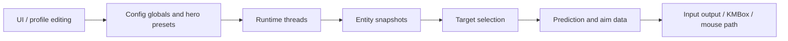

# 00 Reading Map

Source: D:/Desktop/SenseZen/ECS_O/01_PRODUCTS/un-dma/include and D:/Desktop/SenseZen/ECS_O/01_PRODUCTS/un-dma/src
Snapshot: Git HEAD 10e87de + dirty working tree on 2026-06-10.
Purpose: reading notes only, not runtime source of truth.

EN: This note gives you a high-level route through the current Unleashed code. It is meant to reduce the feeling that everything is connected to everything else.
中文：这篇笔记给你一条阅读当前 Unleashed 代码的总路线，目标是降低“所有东西都互相连着”的压力。

## Big Picture



EN: The runtime usually does not ask the UI what the user selected. It reads normalized values from `OW::Config`.
中文：运行时通常不会直接问 UI 用户选了什么，而是读取 `OW::Config` 里已经规范化的值。

EN: Most confusing bugs come from checking only one layer. A visible UI control is not enough; you also need persistence, migration, active profile, and runtime consumption.
中文：最容易误判的问题来自只看一层。界面上有控件还不够，还要看保存、迁移、当前 profile 和运行时是否真的读取。

## Core Reading Groups

EN: Start with these groups instead of opening every file.
中文：先按这些组读，不要一开始就打开所有文件。

```text
UI/config:
  src/Features/UI.cpp
  include/Utils/Config.hpp
  src/Utils/Config.cpp

Entity pipeline:
  include/Game/Overwatch.hpp
  include/Game/Structs.hpp
  include/Game/Entity.hpp

Aim/prediction/fire:
  include/Game/Target.hpp
  include/Game/WeaponSpec.hpp
  src/Game/WeaponSpec.cpp
  include/Game/AimArchitecture.hpp
  src/Game/HeroSkills.cpp
```

EN: `Overwatch.hpp` is huge because it owns several live data loops. Do not read it top to bottom first; read `entity_scan_thread()` and `entity_thread()` as a producer-consumer pair.
中文：`Overwatch.hpp` 很大，因为它承载多个实时数据循环。不要第一次就从头读到尾，先把 `entity_scan_thread()` 和 `entity_thread()` 当成生产者/消费者来读。

EN: `Target.hpp` is also huge because it mixes target selection, prediction, aim shaping, and output helpers. Read it by behavior, not by file order.
中文：`Target.hpp` 也很大，因为它同时包含目标选择、预测、瞄准形状和输出辅助。阅读时按行为读，不要按文件顺序硬啃。

## First Mental Model

EN: The most useful mental model is "snapshot, decide, act".
中文：最有用的心智模型是“快照、决策、执行”。

```text
Snapshot:
  entity_thread publishes OW::entities and local_entity.

Decide:
  AcquireTarget snapshots entities, local player, FOV context, weapon spec, and lock state.

Act:
  Aim and fire helpers convert the selected aim point into output movement and button behavior.
```

EN: Snapshot boundaries matter because rendering, aiming, and entity processing run at different cadences.
中文：快照边界很重要，因为渲染、瞄准、实体处理的运行频率并不完全一样。

## Common Reading Trap

EN: Do not assume a setting is live just because it exists in `Config.hpp`.
中文：不要因为一个设置存在于 `Config.hpp` 就认为它已经真正生效。

EN: A live setting needs at least one write path, one persistence path, and one runtime read path.
中文：一个真正生效的设置至少需要有写入路径、持久化路径和运行时读取路径。

```text
UI control -> OW::Config value -> Save/Load or hero JSON -> active preset -> runtime read
```

EN: If any arrow is missing, the feature may only be visible or only persisted, not actually used.
中文：如果其中任意箭头缺失，这个功能可能只是可见、只是保存了，但没有真正参与运行。
